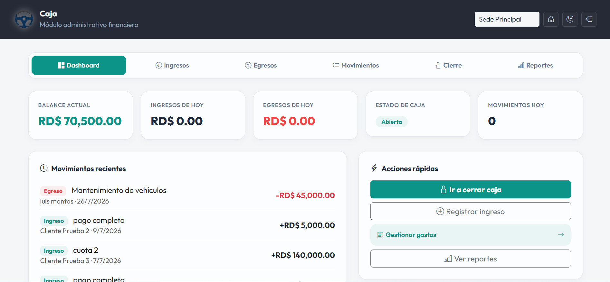
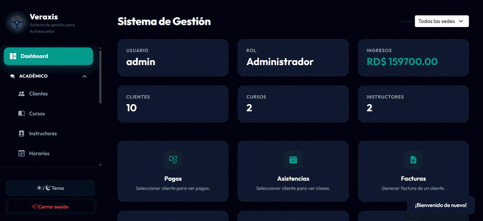
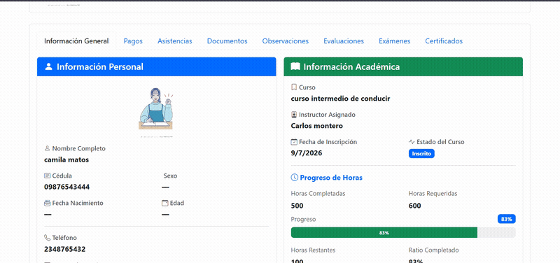
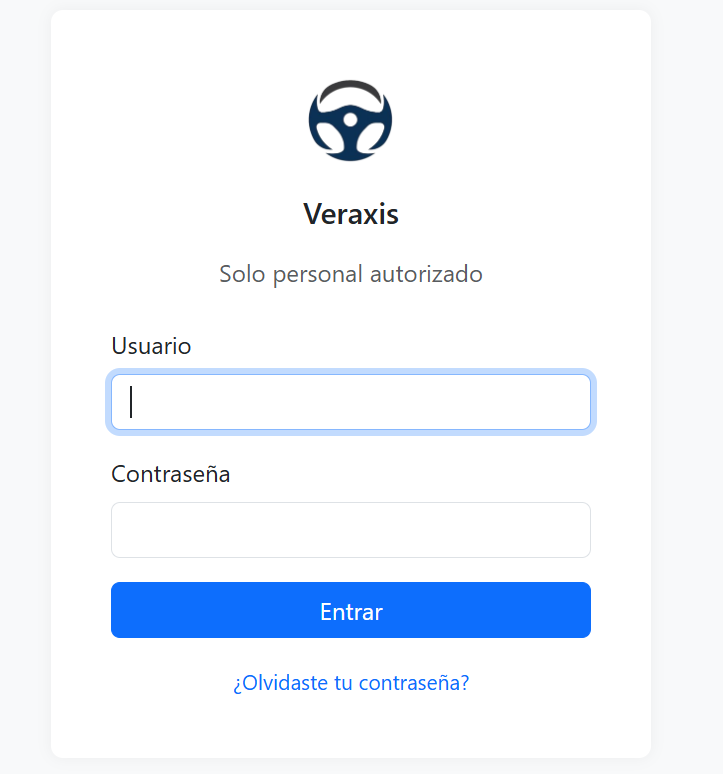
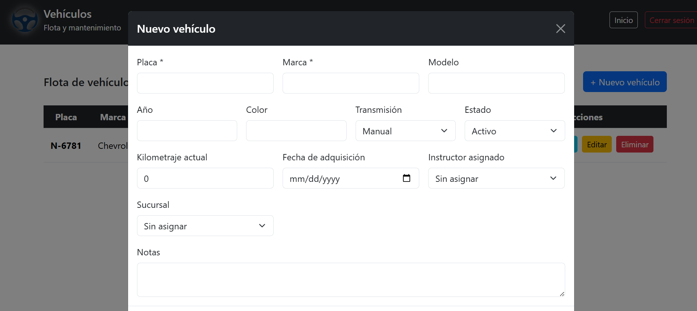
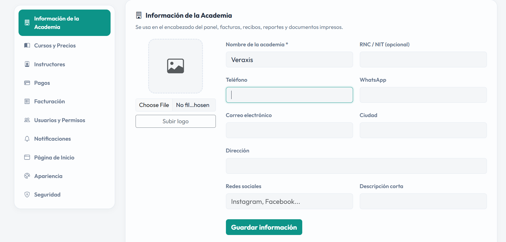
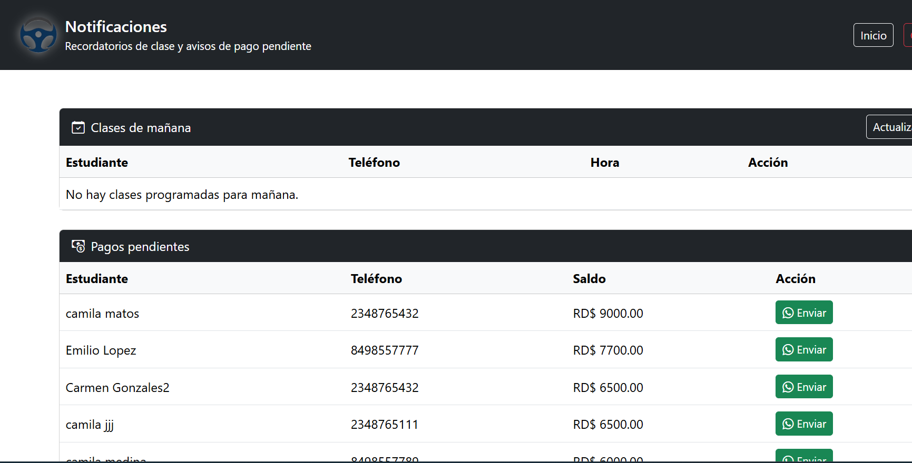

<div align="center">

# 🚗 Veraxis

### Full-stack management system for driving schools

Students, courses, instructors, schedules, payments, cash register, expenses, fleet, multi-branch support, and an executive reporting dashboard — all in one place.


**[🇬🇧 English](README.md)** · **[🇪🇸 Español](README.es.md)**

</div>

<br>

<p align="center">
  
</p>

## Table of Contents

- [Demo](#-demo)
- [About](#about)
- [Key Features](#key-features)
- [Screenshots](#screenshots)
- [Tech Stack](#tech-stack)
- [Architecture](#architecture)
- [Getting Started](#getting-started)
- [License](#license)

## 🎬 Demo

**Public landing page**


**Admin dashboard**



**Student portal**



## About

Veraxis is a full-stack web system built to run the day-to-day operations of a driving school: enrolling students, tracking their theoretical/practical hours, collecting payments, managing instructors and vehicles, closing the daily cash register, and giving owners an executive view of the business — with a dedicated self-service portal for students and role-based access for admins and instructors.

## Key Features

| | |
|---|---|
| 🎓 **Student records** | Personal, contact, emergency-contact, academic and financial data; photo, documents, observations, progress evaluations, exam attempts and issued certificates — all in one profile. |
| 📚 **Courses, instructors & schedules** | Course catalog with pricing, instructor assignment, and class scheduling. |
| 💳 **Payments & invoicing** | Partial payments, multiple payment methods, auto-numbered printable invoices/receipts. |
| ✅ **Attendance tracking** | Per student, per class. |
| 💰 **Cash register (Caja)** | Daily opening/closing with cash reconciliation, unified income/expense movements, configurable categories. |
| 🧾 **Operating expenses** | Fiscal fields for the Dominican Republic (RNC / NCF / ITBIS). |
| 🚐 **Fleet management** | Vehicles and maintenance history. |
| 📊 **Executive reports** | Revenue, enrollment, and operational KPIs. |
| 🏢 **Multi-branch** | Independent cash register and data scoping per physical location. |
| 👩‍🎓 **Student self-service portal** | Students log in to see their own progress, payments and schedule. |
| 🌐 **Public landing page** | Hero, about, gallery and social links, fully editable from Settings — no code required. |
| 📱 **WhatsApp notifications** | One-tap `wa.me` reminders for classes and payment due dates. |
| 🔐 **Role-based access** | `admin`, `instructor`, `estudiante` — enforced on both UI and API. |
| 🕵️ **Audit log** | Tracks key actions across the system. |

## Screenshots

<table>
  <tr>
    <td align="center" width="50%"><br><sub><b>Login</b></sub></td>
    <td align="center" width="50%"><br><sub><b>Cash register (Caja)</b></sub></td>
  </tr>
  <tr>
    <td align="center"><br><sub><b>Fleet management</b></sub></td>
    <td align="center"><br><sub><b>Settings</b></sub></td>
  </tr>
  <tr>
    <td align="center" colspan="2"><br><sub><b>WhatsApp notifications</b></sub></td>
  </tr>
</table>

## Tech Stack

**Frontend**
- Plain HTML5 / CSS3 / vanilla JavaScript — no framework, no bundler, no build step
- [Bootstrap 5](https://getbootstrap.com/) + [Bootstrap Icons](https://icons.getbootstrap.com/) (via CDN)
- Each page is self-contained and talks to the backend directly via `fetch`

**Backend**
- [Node.js](https://nodejs.org/) + [Express 5](https://expressjs.com/)
- REST API following an MVC-ish pattern: `routes/` → `controllers/` → `db.js`
- [PostgreSQL](https://www.postgresql.org/) (hosted on [Neon](https://neon.tech/)) accessed via the [`pg`](https://node-postgres.com/) driver — raw parameterized SQL, no ORM
- Idempotent schema migrations run on startup (`CREATE TABLE IF NOT EXISTS` / `ADD COLUMN IF NOT EXISTS`)

**Auth & Security**
- [JSON Web Tokens](https://github.com/auth0/node-jsonwebtoken) (`jsonwebtoken`) for stateless authentication
- Password hashing with `bcrypt` / `bcryptjs`
- Role-based middleware (`requireAdmin`, `verifyToken`) protecting API routes
- Per-client access checks to prevent IDOR (a student can only reach their own record)
- Upload validation (file type/size) via `multer`

**Other**
- [Winston](https://github.com/winstonjs/winston) for centralized logging
- [Jest](https://jestjs.io/) test suite, run automatically on every push/PR via **GitHub Actions** CI

## Architecture

```
Montas/
├── *.html, css/, js/, assets/   → frontend (static, no build step)
└── montas-backend/
    ├── index.js                 → app entrypoint (CORS, routes, DB bootstrap)
    ├── db.js                    → shared PostgreSQL pool
    ├── routes/                  → thin Express routers (one per resource)
    ├── controllers/             → business logic + parameterized SQL
    ├── middlewares/             → auth, roles, upload validation
    ├── scripts/                 → one-off admin/DB scripts
    └── __tests__/                → Jest test suite
```

## Getting Started

**Requirements:** Node.js 20+, a PostgreSQL database (e.g. a free [Neon](https://neon.tech/) instance).

```bash
# 1. Install dependencies (covers both frontend tooling and backend)
npm install

# 2. Configure environment variables
cp montas-backend/.env.example montas-backend/.env
# then fill in DATABASE_URL, PORT, JWT_SECRET, JWT_EXPIRES_IN

# 3. Start the backend (also runs schema migrations on boot)
node montas-backend/index.js
# → API + frontend served from http://localhost:4000
```

Once the backend is running, it also serves the frontend directly — just open `http://localhost:4000`. For local frontend-only development you can alternatively serve the repo root with any static server (e.g. VS Code Live Server); in that case the frontend still talks to the API at `http://localhost:4000`.

```bash
# Run the test suite
npm test
```

## License

Proprietary — all rights reserved. See [LICENSE](LICENSE). Reselling, redistributing, or reusing this code (in whole or in part) without explicit written permission from the author is prohibited.

<div align="center">

<br>

Built by [Luzmy555](https://github.com/Luzmy555)

</div>
